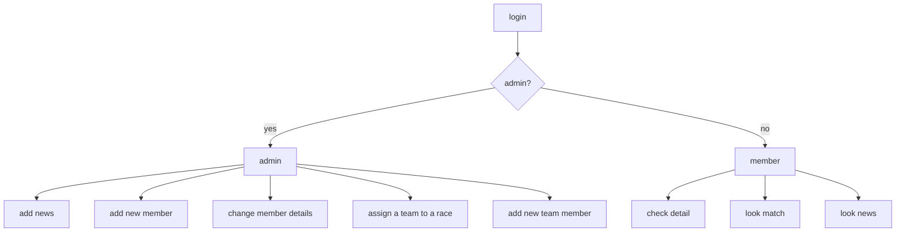

### 1. 系统演示

1）登录界面，用户通过下拉菜单选择对应的姓名，点击进入即可；

2)系统会自行判断用户是否是管理员用户，是则进入管理员界面否则进入普通用户界面；

3)普通用户界面如下，可以查看俱乐部的最近三个News，并且可以查看自己队伍的比赛信息也可以更新自己部分信息，只需要点击菜单栏对应位置的功能按钮；

3.1)点击News查看通知；

3.2) 点击Match查看比赛信息；

3.3)点击最后一个按钮查看个人信息并可以提交修改；

4)管理员用户界面如下，实现了增加最新的通知，添加新成员，修改成员信息，安排比赛，添加新球队，为球队填充人员等功能，界面如下；

4.1）管理员部分功能展示，News功能，输入标题，报告人，日期，再输入通知内容点击update按钮即可提交至后台，完成数据库的更新。注意：要将Identity下拉框选至News；

4.2）管理员部分功能展示，Home Match功能，该菜单实现了俱乐部安排主场比赛的功能，在Home Team下拉框中只能用俱乐部现有的队伍安排比赛，Away Team是客场队伍，是其他俱乐部的其他队伍，输入对应的球队和日期时间后点击提交即可，系统前端会自行判断安排的两个队伍级别是否相同，如果不相同则会弹出窗口提示级别别不相等，需要再行安排其他队伍，级别相同才能提交后台完成数据库更新；Away Match类似，只是俱乐部队伍变成了客场队伍，得在Away Team中选择；Practice按钮实现的是俱乐部内部比赛，是练习赛的作用；注意：要将Identity下拉框选至对应的提交内容，Home Match是Home_Match，Away Match是Away_Match，Practice是Practice;

4.3) 管理员部分功能展示，Join Team功能，该菜单功能是给成员分配队伍用的，在Name下拉框中选择对应的成员名字，在Team下拉框中选择对应的队伍，注意：此时需要在Identity下选择对应的动作为Join_Team，最后点击update按钮提交表单即可，如果选中的成员年龄不符合分配队伍的资格，系统前端同样会弹出窗口提示目前该成员不能参加该队伍，需要重新分配；

### 2.设计路线

#### 2.1 系统流程图

从登录开始，判断用户是否是admin是则进入admin页面否则进入member页面；不同界面对应了不同功能，如图所示。因此我们需要三个不同的页面，分别是login界面提供登录功能，admin界面提供系统管理功能，member界面提供用户查询和浏览功能，对应的html文件是login.html，admin.html和main.html。

#### 2.2 设计方案

##### 2.2.1 登录界面

设计一个用户名下拉框选择对应的用户点击即可登录，由于储存用户信息的表member在后台MySQL数据库中，需要传递到前端供用户选择因此，在用户访问**'/'**路由时系统需要从数据库中提取member信息，并将数据格式化为字典的形似传递给前端，使用了***render_template('login.html',members=members_names)***函数渲染login模板，并将数据信息传给前端，前端需要使用***Jinja2***模板语言接收对应的数据如在login.html中使用了循环语句生成不同的用户名单。

##### 2.2.2 admin判断

当用户选择完之后点击Entry后，页面会跳到**/user**页面并提交选择的用户名，我设置了一个***members_admin_status***字典，包含了用户是否是admin的信息，根据提交的用户名在该字典中判断是否admin是则通过***render_template***函数渲染***main.html***模板否则跳转至**/admin**页面，即***redirect("/admin")***。同时如果是普通用户，我们需要传递给前端通知信息，比赛信息和个人部分信息。这些信息也存在于数据库中需要提取出来并传递给前端，传递方式也是使用了***render_template***函数，和**2.2.1**相似。

##### 2.2.3 菜单功能

为了实现查看/编辑新闻，添加/修改成员信息等不同功能，我设计了一系列的菜单按钮，用来执行不同的功能需求。我利用大量的***JavaScript***对点击的菜单实现了前端的动态渲染，点击不同的按钮便会触发生成不同页面结构，来满足大部分需求。

##### 2.2.4 表单验证

在admin界面需要提交许多数据到后台进行更新，其中有几个需要注意的地方，（1）当为队伍添加成员时，不同级别的队伍对队员的年龄会有要求。（2）安排队伍比赛时，只有同级别的队伍才能安排比赛。在后台队伍的成员信息和比赛信息都是储存在后台数据库中，只有符合条件的数据才允许录入，因此需要对前端提交的数据进行判断，在这里我把判断的模块放在前端，即在表单提交时进行验证，如果不符合规范就不提交后台，只需要给表单添加***onsubmit***属性并赋予值即可。当有不符合规范的数据提交时，前端会弹出窗口提醒。表单验证有助于减轻后台压力，缩短系统响应时间。

