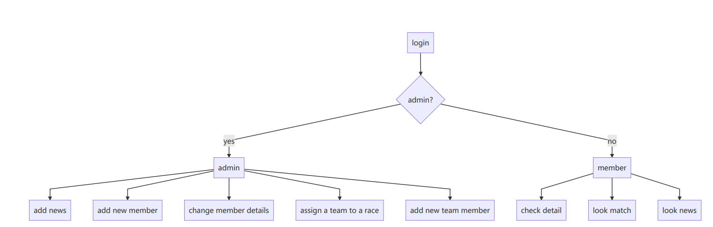

# 1. System Display

1）In the login interface, the user can select the corresponding name through the drop-down menu and click to enter；

2)The system will judge whether the user is an administrator by itself. If yes, enter the administrator interface, otherwise enter the ordinary user interface；

3)The common user interface is as follows. You can view the lasting three news of the club, view your team's game information, and update some of your own information. Just click the function button at the corresponding position of the menu bar；

3.1)Click "News" to view the notification；

3.2) Click "Match" to view the competition information of your team；

3.3)Click the last button to view the personal information and you can submit the modification to system；

4)The administrator interface is as follows, which realizes the functions of adding the latest notice, adding new members, modifying Member information, arranging matches, adding new teams, filling personnel for the team, etc；

4.1）The administrator part of the function display:,the news function: enter the title, reporter and date, then enter the notification content, and click the update button to submit to the background system to complete the database update. Note: select the identity drop-down box to "News";

4.2）Home match function: This menu realizes the function of the club to arrange the home game. In the home team drop-down box, only the existing team of the club can be used to arrange the game. Away team is the away team and other teams of other clubs. Enter the corresponding team, date and time and click Submit, The front end of the system will judge whether the levels of the two teams arranged are the same. If they are different, a window will pop up to prompt that the levels are different. You need to arrange other teams with the same levels before submitting them to the background to complete the database update; The away match is similar, but the club team has become an away team, so you have to choose from the away team; The practice button realizes the internal competition of the club and the function of practice competition; Note: to select the identity drop-down box to the corresponding submission, home match is "Home_ Match", away match is "Away_ Match", practice is "Practice";

4.3) Join team function. This menu function is used to assign teams to members. Select the corresponding member name in the Name drop-down box and the corresponding team in the team drop-down box. Note: at this time, you need to select the corresponding action under identity as "Join_ Team". Finally, click the update button to submit the form. If the age of the selected member does not meet the qualification of the assigned team, a window will pop up at the front end of the system, indicating that the member cannot participate in the team and needs to be reassigned；

# 2.Design Route

## 2.1 System Flow Chart

From login start, judge whether the user is admin. If yes, enter the admin page, otherwise enter the member page; Different interfaces correspond to different functions, as shown in the figure. Therefore, we need three different pages: login interface provides login function, admin interface provides system management function, and member interface provides user query and browsing function. The corresponding HTML files are login.html, admin.html and main.html.

## 2.2 Design Scheme

### 2.2.1 Login Interface

A user name drop-down box is designed to select the corresponding user and click to log in. Since the table member storing user information is in the background MySQL database, it needs to be passed to the front end for users to choose. Therefore, when users access **'/'** route, the system needs to extract member information from the database, format the data as a dictionary and pass it to the front end. ***render is used_ The template ('login. HTML ', members = members_names)*** function renders the login template and transmits the data information to the front end. The front end needs to use ***jinja2*** template language to receive the corresponding data. For example, a circular statement is used in login.html to generate different user lists.

### 2.2.2 Is Admin?

When the user clicks enter after selecting, the page will jump to the **/user** page and submit the selected user name. I set a ***members_ admin_ The status*** dictionary contains information about whether the user is admin. Judge whether admin is in the dictionary according to the submitted user name, and then use ***render_ The template*** function renders the ***main. HTML*** template. Otherwise, it jumps to the **/Admin** page, that is, ***redirect ("/Admin")***. At the same time, if it is an ordinary user, we need to pass the notification information, competition information and personal information to the front end. This information also exists in the database and needs to be extracted and passed to the front end. ***render is also used for transmission_ Template*** function, similar to **2.2.1**.

### 2.2.3 Menu Function

In order to realize different functions such as viewing/Editing News and adding/modifying Member information, I designed a series of menu buttons to implement different functional requirements. I use a large number of ***JavaScript*** to realize the dynamic rendering of the front-end of the clicked menu. Clicking different buttons will trigger the generation of different page structures to meet most needs.

### 2.2.4 Form Validation

In the admin interface, you need to submit a lot of data to the background for updating. There are several points to pay attention to: (1) when adding members to the team, teams at different levels will have requirements on the age of the team members. (2) When arranging team competitions, only teams of the same level can arrange competitions. In the background, the team member information and competition information are stored in the background database, and only qualified data can be entered. Therefore, it is necessary to judge the data submitted by the front end. Here, I put the judgment module in the front end, that is, verify when the form is submitted. If it does not meet the specifications, it will not be submitted to the background, Just add ***onsubmit*** attribute to the form and assign a value. When there is non-conforming data submitted, the front end will pop up a window to remind. Form validation helps to reduce background pressure and shorten system response time.

